# Logb grammar

A BNF description of the Logb wire format, version 0.1. Normative text is
[SPEC.md](SPEC.md); this is the same bytes stated as a grammar, for anyone
writing a parser.

## Notation

```
<x>          nonterminal
"..."        literal bytes, hex
x*           zero or more
x+           one or more
[ x ]        optional
x | y        alternative
x{n}         exactly n repetitions
(* ... *)    comment
```

Terminals are fixed-width little-endian integers unless stated otherwise:

```
<u8>  <i8>   1 byte
<u16>        2 bytes, little-endian
<u32>        4 bytes, little-endian
<u64> <i64>  8 bytes, little-endian
<f64>        8 bytes, IEEE 754 binary64, little-endian
<byte>       1 uninterpreted byte
```

Two composite terminals recur everywhere:

```
<string>   ::= <u32> <byte>{n}        (* n = the u32; UTF-8, not NUL-terminated *)
<kv>       ::= <u32> <kv-pair>{n}     (* n = the u32; keys sorted, §wire.go *)
<kv-pair>  ::= <string> <string>      (* key, value *)
```

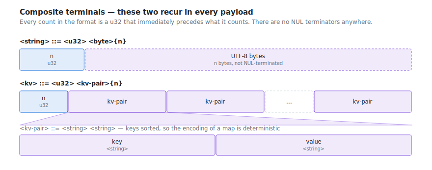

Grammar alone cannot state the length and cross-reference constraints; those are
listed under [Context conditions](#context-conditions) and a conforming reader
enforces them.

## File

```
<file>     ::= <file-header> <segment>* [ <index-frame> ] [ <end-frame> ]

<segment>  ::= <sync-frame> <schema-frame>+ <run-frame>* <segment-body>*

<segment-body> ::= <meta-frame> | <attach-frame> | <data-frame>
```

A file truncated at any byte is a valid file containing every complete frame
before the cut (rule 2), so every construct above is effectively optional at the
tail. Concatenation appends a second file minus its `<file-header>`, which means
`<index-frame>` and `<end-frame>` may also appear *between* segments.

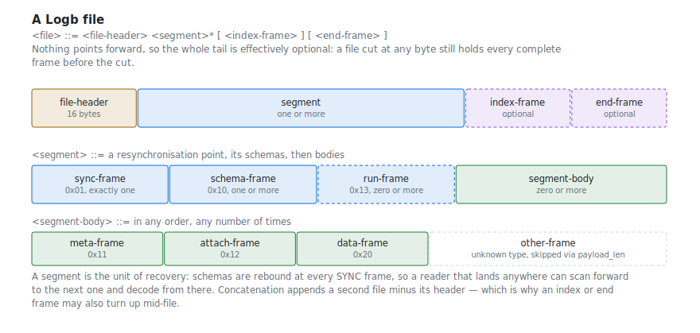

```
<file-header> ::= <magic> <version-major> <version-minor> <header-crc>

<magic>         ::= "89 4C 4F 47 42 0D 0A 1A"   (* \x89 L O G B \r \n \x1a *)
<version-major> ::= <u16>                       (* 0 *)
<version-minor> ::= <u16>                       (* 1 *)
<header-crc>    ::= <u32>                       (* crc32c of bytes 0..11 *)
```

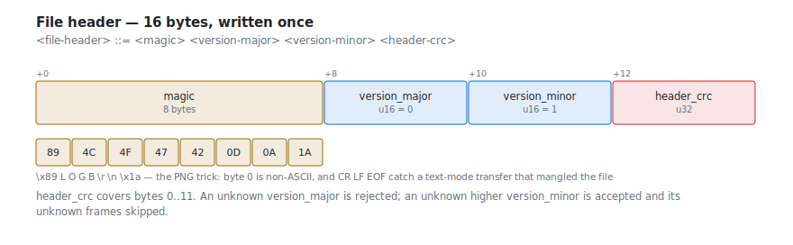

## Frame

Every frame after the file header has one shape.

```
<frame>       ::= <frame-header> <payload> <frame-crc>

<frame-header> ::= <payload-len> <frame-type> <flags> <stream-id>
<payload-len>  ::= <u32>          (* bytes of payload only *)
<frame-type>   ::= <u8>
<flags>        ::= <u8>           (* no flags defined in v0.1; write 0 *)
<stream-id>    ::= <u16>          (* 0 if not stream-scoped *)
<payload>      ::= <byte>{payload_len}
<frame-crc>    ::= <u32>          (* crc32c over frame-header and payload *)
```

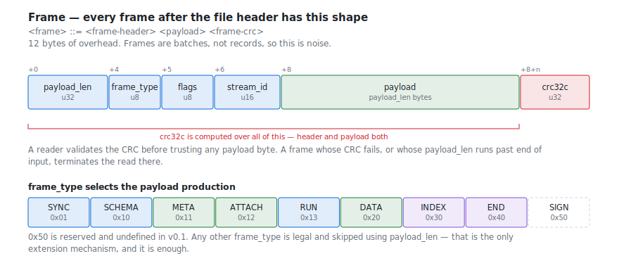

The frame type selects the payload production:

```
<sync-frame>   ::= <frame>   (* frame_type = 0x01, payload = <sync-payload>   *)
<schema-frame> ::= <frame>   (* frame_type = 0x10, payload = <schema-payload> *)
<meta-frame>   ::= <frame>   (* frame_type = 0x11, payload = <meta-payload>   *)
<attach-frame> ::= <frame>   (* frame_type = 0x12, payload = <attach-payload> *)
<run-frame>    ::= <frame>   (* frame_type = 0x13, payload = <run-payload>    *)
<data-frame>   ::= <frame>   (* frame_type = 0x20, payload = <data-payload>   *)
<index-frame>  ::= <frame>   (* frame_type = 0x30, payload = <index-payload>  *)
<end-frame>    ::= <frame>   (* frame_type = 0x40, payload is empty           *)
<sign-frame>   ::= <frame>   (* frame_type = 0x50, reserved, undefined in 0.1 *)
<other-frame>  ::= <frame>   (* any other frame_type: skipped via payload_len *)
```

Any frame type not listed is legal and skipped using `payload_len`; that is the
only extension mechanism. A reader that skips one is still conforming, so
`<other-frame>` may appear anywhere `<segment-body>` may.

## SYNC — 0x01

```
<sync-payload> ::= <sync-pattern> <segment-seq> <wall-time-ns>

<sync-pattern> ::= "4C 4F 47 42 53 59 4E 43 A7 3E 91 D2 5C 68 0B F4"
<segment-seq>  ::= <u64>   (* monotonic from 0 *)
<wall-time-ns> ::= <i64>   (* wall clock at segment start, 0 if unknown *)
```

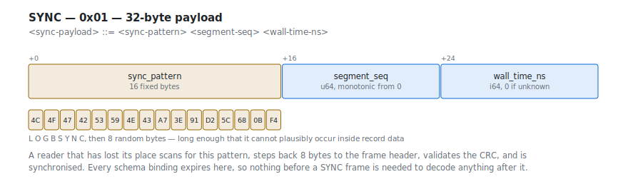

## SCHEMA — 0x10

`stream_id` in the frame header binds this schema for the rest of the segment.

```
<schema-payload> ::= <stream-uuid> <stream-name> <record-bits>
                     <axis-kind> <axis-mode> <axis-exp> <reserved8>
                     <axis-unit> <axis-step> <axis-scale> <axis-field>
                     <field-count> <field>{field_count} <kv>

<stream-uuid> ::= <byte>{16}   (* opaque; identity across segments and files *)
<stream-name> ::= <string>
<record-bits> ::= <u32>        (* fixed portion of a record, bit-exact *)
<axis-kind>   ::= <u8>         (* 0 time, 1 frequency, 2 angle,
                                  3 distance, 4 index, 5 other *)
<axis-mode>   ::= <u8>         (* 0 implicit uniform, 1 explicit field,
                                  2 implicit log *)
<axis-exp>    ::= <i8>         (* time only: tick = 10^axis_exp seconds *)
<reserved8>   ::= <u8>         (* write 0 *)
<axis-unit>   ::= <string>     (* "s", "Hz", "V", "deg" *)
<axis-step>   ::= <i64> | <f64>   (* i64 ticks if axis_kind = time, else f64;
                                     the ratio, always f64, if axis_mode = 2 *)
<axis-scale>  ::= <i64> | <f64>   (* explicit mode only; same rule *)
<axis-field>  ::= <u16>        (* explicit mode only; index into fields *)
<field-count> ::= <u16>
```

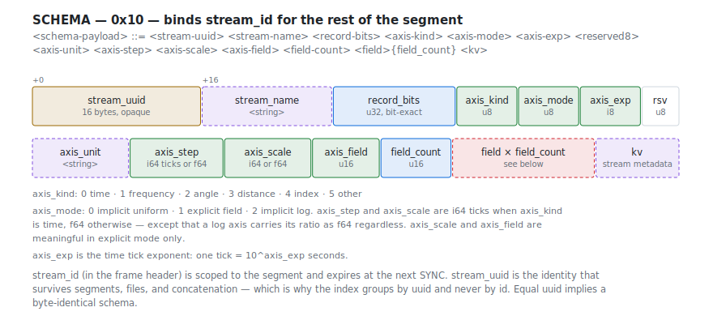

### Field

```
<field> ::= <field-name> <bit-offset> <bit-width>
            <data-type> <byte-order> <field-flags>
            <unit> <desc> <conversion>
            [ <guard-field> <guard-value> ]     (* iff field_flags bit1 *)
            <kv>

<field-name>  ::= <string>
<bit-offset>  ::= <u32>   (* from start of record; numbering follows byte_order *)
<bit-width>   ::= <u32>   (* 0 for a variable-length field *)
<data-type>   ::= <u8>    (* 0 uint, 1 sint, 2 float, 3 bool,
                             4 bytes, 5 string, 6 complex *)
<byte-order>  ::= <u8>    (* 0 little, 1 big *)
<field-flags> ::= <u8>    (* bit0 variable-length (tail), bit1 guarded *)
<unit>        ::= <string>
<desc>        ::= <string>
<guard-field> ::= <u16>   (* index into fields of this schema *)
<guard-value> ::= <u64>   (* raw value, compared before conversion *)
```

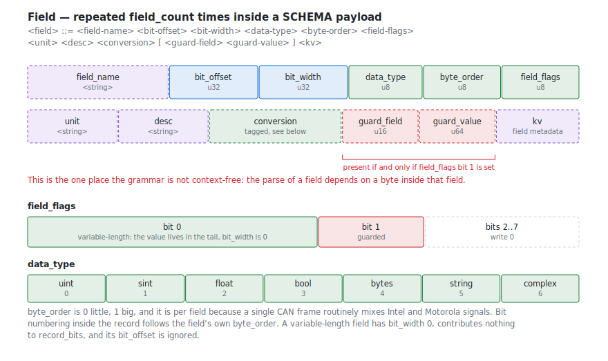

The optional `<guard-field> <guard-value>` pair is present in the byte stream if
and only if bit 1 of `<field-flags>` is set. This is the one place the grammar is
not context-free: the parse of a field depends on a byte inside that field.

### Conversion

A tagged struct: one type byte, then type-specific parameters.

```
<conversion> ::= <conv-identity> | <conv-linear> | <conv-rational>
               | <conv-table>    | <conv-table-interp>
               | <conv-v2t>      | <conv-r2t>

<conv-identity>     ::= "00"
<conv-linear>       ::= "01" <f64> <f64>            (* a, b -> a + b*x *)
<conv-rational>     ::= "02" <f64>{6}               (* p1..p6 *)
<conv-table>        ::= "03" <table-body>           (* lookup, no interpolation *)
<conv-table-interp> ::= "04" <table-body>           (* lookup, interpolated *)
<conv-v2t>          ::= "05" <u32> <v2t-entry>{n} <default>
<conv-r2t>          ::= "06" <u32> <r2t-entry>{n} <default>

<table-body> ::= <u32> <table-entry>{n}
<table-entry> ::= <f64> <f64>               (* key, val *)
<v2t-entry>   ::= <f64> <string>            (* key, text *)
<r2t-entry>   ::= <f64> <f64> <string>      (* lo, hi, text *)
<default>     ::= <string>
```

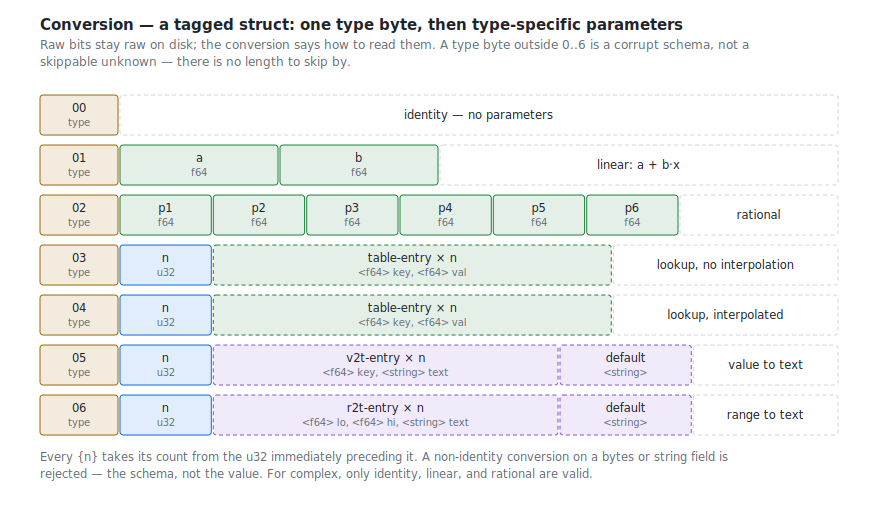

Every `{n}` above takes its count from the `<u32>` immediately preceding it. A
conversion type byte outside 0..6 is a corrupt schema, not a skippable unknown:
there is no length to skip by.

## META — 0x11

```
<meta-payload> ::= <string> <string>    (* key, value; one pair per frame *)
```

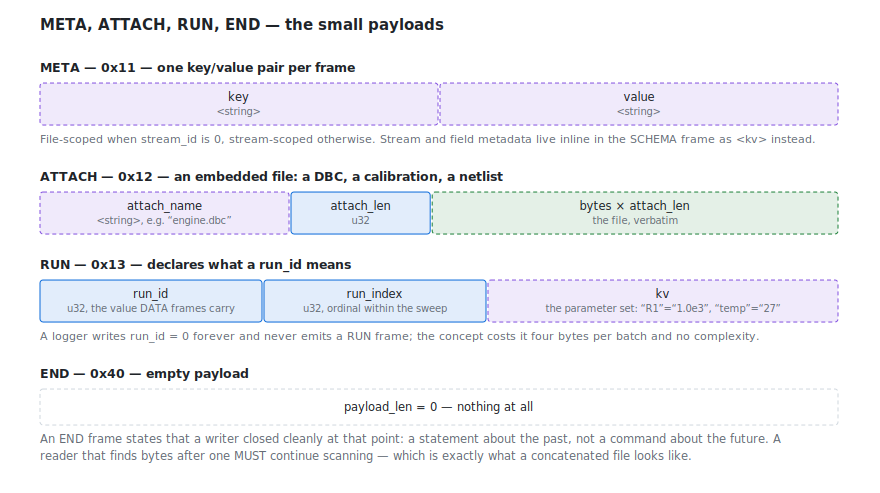

The diagram above also covers ATTACH, RUN and END.

File-scoped when `stream_id` is 0, stream-scoped otherwise. Stream and field
metadata live inline in the SCHEMA frame as `<kv>` instead.

## ATTACH — 0x12

```
<attach-payload> ::= <attach-name> <attach-len> <byte>{attach_len}

<attach-name> ::= <string>   (* e.g. "engine.dbc" *)
<attach-len>  ::= <u32>
```

## RUN — 0x13

```
<run-payload> ::= <run-id> <run-index> <kv>

<run-id>    ::= <u32>   (* the value DATA frames carry *)
<run-index> ::= <u32>   (* ordinal within the sweep *)
```

The `<kv>` is the run's parameter set: `"R1"="1.0e3"`, `"temp"="27"`.

## DATA — 0x20

```
<data-payload> ::= <axis-base> <record-count> <run-id> <codec> <filter>
                   <reserved16> <raw-size> <records>

<axis-base>    ::= <i64> | <f64>   (* i64 ticks if axis_kind = time, else f64 *)
<record-count> ::= <u32>
<run-id>       ::= <u32>           (* 0 if the stream has no runs *)
<codec>        ::= <u8>            (* 0 none, 1 zstd, 2 lz4, 3 deflate *)
<filter>       ::= <u8>            (* 0 none, 1 transpose *)
<reserved16>   ::= <u16>           (* write 0 *)
<raw-size>     ::= <u64>           (* payload size after decode *)
<records>      ::= <byte>*         (* to end of payload; codec- and
                                      filter-encoded <record-region> *)
```

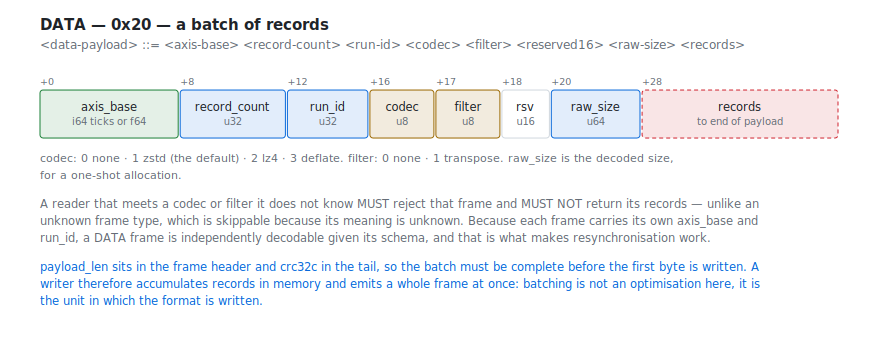

After decompression and de-transposition, the region is:

```
<record-region> ::= <fixed>{record_count} <tail>{record_count}

<fixed> ::= <byte>{ceil(record_bits / 8)}
<tail>  ::= <tail-value>{v}     (* v = number of variable-length fields,
                                   in field-declaration order *)
<tail-value> ::= <u32> <byte>{n}
```

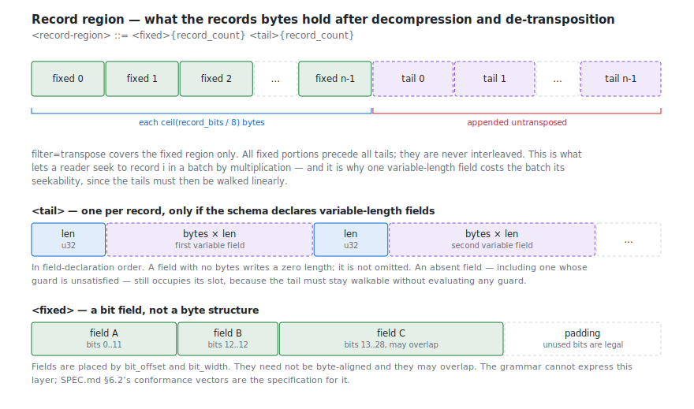

All fixed portions precede all tails; they are never interleaved. `filter =
transpose` covers the fixed region only — the tail region is appended to it
untransposed. A variable-length field that is absent, including one whose guard
is unsatisfied, writes a zero length and is not omitted.

The fixed portion is a bit field, not a byte structure: `<field>` positions are
`bit_offset`/`bit_width` within it, they may overlap, and they need not be
byte-aligned. The grammar cannot express that layer; §6.2's conformance vectors
are the specification for it.

## INDEX — 0x30

```
<index-payload> ::= <stream-count> <index-group>{stream_count}

<index-group> ::= <stream-uuid> <entry-count> <index-entry>{entry_count}

<stream-count> ::= <u32>
<entry-count>  ::= <u32>
<index-entry>  ::= <back-offset> <first-axis> <record-count> <run-id>

<back-offset>  ::= <u64>          (* bytes backwards from this frame's start *)
<first-axis>   ::= <i64> | <f64>  (* per the stream's axis_kind *)
```

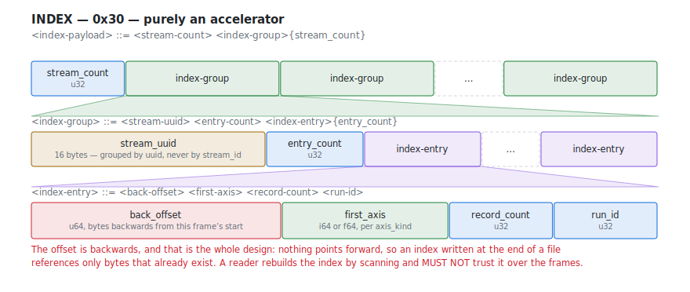

Grouped by `stream_uuid`, never by `stream_id`. Purely an accelerator: a reader
rebuilds it by scanning and MUST NOT trust it over the frames.

## END — 0x40

```
<end-payload> ::=      (* empty *)
```

An END frame states that a writer closed cleanly at that point. It does not end
the read: a reader that finds bytes after it continues scanning, which is what a
concatenated file looks like.

## Context conditions

The grammar admits byte sequences the format does not. A conforming reader
checks, and rejects:

**Framing**
- `crc32c` over each frame's header and payload matches `<frame-crc>`; a
  mismatch, or a `payload_len` running past end of input, terminates the read.
- `version_major` is known. An unknown higher `version_minor` is accepted.

**Schema**
- Within a segment, a `stream_id` carries exactly one schema. Across segments,
  equal `stream_uuid` implies a byte-identical schema.
- `axis_mode = 2` (implicit log) with `axis_kind = 0` (time) is rejected; so is
  `axis_base = 0`, or a ratio that is not finite, positive, and ≠ 1.
- An unknown `axis_mode` causes the *stream* to be skipped, not the file.
- `axis_field` indexes a declared field when `axis_mode = 1`.

**Fields**
- A `bytes` or `string` field with `field_flags` bit 0 clear is byte-aligned and
  byte-sized; any other alignment is rejected.
- A variable-length field has `bit_width = 0` and contributes nothing to
  `record_bits`; its `bit_offset` is ignored and should be 0.
- A non-identity conversion on a `bytes` or `string` field is rejected — the
  schema, not the value.
- For `complex`, only `identity`, `linear`, and `rational` are valid; the table
  and text conversions are rejected.
- `float` widths are 16, 32, or 64; `complex` is 64 or 128; `bool` is 1 bit;
  `uint`/`sint` are 1..64 bits.

**Guards**
- `guard_field` indexes a field of this schema and is not the guarded field.
- The guard field is `uint`, `sint`, or `bool`; it is neither guarded itself nor
  variable-length. Guards do not chain.
- All of this is decidable when the SCHEMA frame is read, so a violation rejects
  the schema rather than a record.
- An unsatisfied guard means the field is *absent*. A reader returns no value —
  not zero, not the underlying bits.

**Data**
- An unknown `codec` or `filter` rejects that frame; its records are not
  returned. This differs from an unknown frame type, which is skipped.
- Within a segment, a stream's DATA frames are grouped by `run_id`: once it
  changes, the previous value does not reappear before the next SYNC frame.
