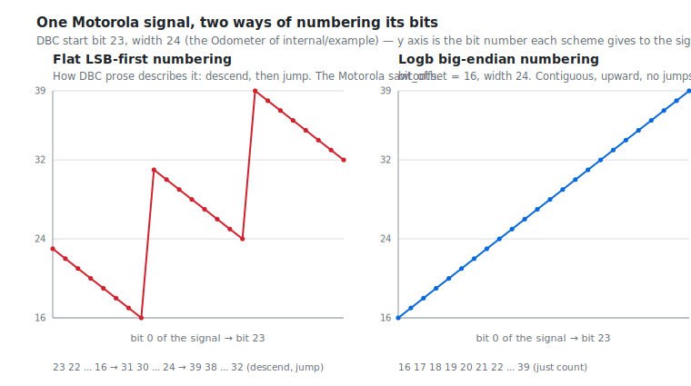
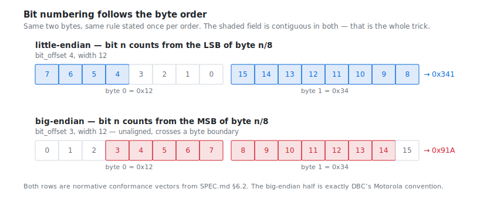
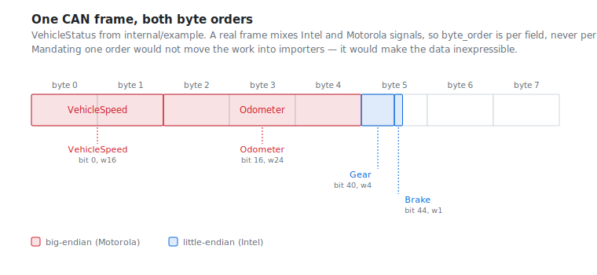

# CAN, DBC, and the bit-ordering mess

This is the long-form answer to a narrow question: *why does Logb define bit
numbering the way it does?* The short answer is in [SPEC.md §6.2](SPEC.md). This
document is the reasoning, because the rule looks arbitrary until you have seen
what it is reacting to.

If you have ever written a CAN tool, you have scar tissue here.

## The problem

A CAN frame is eight bytes with no structure of its own. What turns those bytes
into `EngineSpeed` and `Odometer` is a database — usually a DBC file — that says,
for each signal, where its bits are. So a signal is a *bit slice*: a start
position, a width, and a byte order.

That last part is the trouble. **A single CAN frame routinely mixes byte orders.**
The ECM team ships a message with little-endian ("Intel") signals; the ABS team
ships one with big-endian ("Motorola") signals; sometimes one message has both,
because two people wrote it. This is not pathological, it is Tuesday. Any format
that cannot express both, per signal, is unusable for bus data.

Both conventions have to coexist, and describing them in one numbering scheme is
where every format so far has come to grief.

## What went wrong: the Motorola sawtooth

DBC numbers bits **flat, LSB-first**: bit 0 is the least significant bit of byte
0, bit 7 is the most significant bit of byte 0, bit 8 is the LSB of byte 1, and
so on. One numbering for the whole frame.

Little-endian signals are contiguous in that numbering. A 12-bit Intel signal at
bit 4 occupies bits 4 through 15. Nothing to explain.

Big-endian signals are where it falls apart. A DBC `start_bit` for a Motorola
signal names the signal's **most significant bit**, and the rest of the signal is
found by walking: descend through the byte, and on leaving the bottom of a byte,
jump to the *top* of the next one. Vector's reference algorithm is literally this:

```go
bit := start
for i := 0; i < length; i++ {
	v = v<<1 | uint64(d[bit/8]>>(bit%8))&1
	if bit%8 == 0 {
		bit += 15 // leave the byte: jump to bit 7 of the next
	} else {
		bit-- // descend
	}
}
```

Plot the bit numbers that walk visits and you get the thing the CAN world named
the **Motorola sawtooth**:



Both panels describe *the same 24 physical bits of the same frame* — the Odometer
signal of [`internal/example`](internal/example/example.go), DBC start bit 23.
Left is that signal's bits in flat LSB-first numbering: 23, 22, … 16, then a jump
up to 31, down to 24, up to 39, down to 32. Right is the same signal in Logb's
big-endian numbering: 16, 17, 18, … 39. Contiguous, upward, no jumps.

Nothing moved. No bytes were swapped, no data was transformed. The only
difference is which numbering you describe the bits *in*.

**The sawtooth is not a property of Motorola signals. It is an artefact of
describing big-endian fields in little-endian numbering.** It is what you get for
insisting on one flat numbering and then bolting on a rule for how the other byte
order walks through it.

### The cost of that artefact

The sawtooth is not merely ugly. It has produced real, lasting damage:

- **Formats disagree.** DBC and MDF4 do not use the same bit numbering, so every
  importer is a conversion, and every conversion is a place to be wrong.
- **Unaligned big-endian is undefined.** A Motorola signal that is not
  byte-aligned *and* crosses a byte boundary has no defined meaning in MDF4. It
  is not that the answer is hard — there is no answer to look up. Every tool
  guesses, and the guesses do not agree.
- **The prose is always wrong.** This is the deep one. Every English statement of
  bit numbering ever written has been ambiguous, wrong, or both — including two
  earlier drafts of this repository's own spec. MDF4 and DBC do not disagree
  because anyone was careless. They disagree because this is genuinely,
  structurally hard to say in words.

A wrong bit rule does not crash. It returns plausible-looking garbage: a speed
that is *almost* right, an odometer that drifts. That is the failure mode worth
designing against.

## What Logb does

**Bit numbering follows the byte order.** That is the entire rule, and it has no
exceptions:

- **`byte_order = little`** — bit *n* is byte *n/8*, bit *n%8* counting from the
  **least significant** bit of that byte.
- **`byte_order = big`** — bit *n* is byte *n/8*, bit *n%8* counting from the
  **most significant** bit of that byte.

In both cases `bit_offset` names the field's **first bit**, and the field is
`bit_width` bits running **upward** from it. No alignment requirement, no jump,
no special case for crossing a byte boundary.



Why it works: **each byte order's fields are contiguous in that order's own
numbering.** Little-endian signals run contiguously from the LSB; big-endian
signals run contiguously from the MSB. That is a fact about the two conventions,
not a trick. Number each in its own terms and the sawtooth simply does not exist
— there is nothing to state, because there is no walk.

The conventional approach states one numbering plus a walking rule, and spends
the rest of its life apologising. Logb states two numberings and no walking rule.

## The DBC importer is one line

The big-endian half of the rule **is** DBC's Motorola convention. Not a
near-relative of it — the same thing, said in numbering that suits it. So
importing a Motorola signal is an offset transform:

```go
func dbcStartToOffset(start int) uint32 { return uint32(8*(start/8) + (7 - start%8)) }
```

That is the whole cost. No data moves, nothing is lost, and every Motorola signal
— aligned or not, byte-crossing or not — is a Logb field.

This claim is load-bearing, so it is tested rather than asserted.
`TestDBCMotorola` transcribes Vector's reference walk independently of this
package's `extractBits` and checks that two unrelated formulations agree across
every combination of signal position, width, and payload:

```
$ go test -run TestDBCMotorola -v
    logb_test.go:889: agreed with the DBC reference algorithm on 465600 cases
--- PASS: TestDBCMotorola (0.03s)
```

If that test ever fails, the format has silently forked from every CAN tool in
existence.

## Why not just mandate one byte order?

It is the obvious simplification, and it was considered and rejected. The
tempting argument is that a single order pushes the work out to importers, where
it belongs.

It does not. **It makes the data inexpressible.**

Take every Motorola signal up to 32 bits wide that fits in an 8-byte CAN frame —
there are 1,552 of them. Ask how many have *any* little-endian bit-slice that
reads the same bits in the same order:

| Motorola signals (≤32 bits, 8-byte frame) | 1,552 |
|---|---|
| …with a little-endian equivalent | 288 |
| …of those, wider than one byte | **0** |

Only 288 are expressible at all, and **not one of them is wider than a single
byte**. A plain byte-aligned 16-bit Motorola signal — utterly ordinary, in
thousands of real DBC files — has *no* little-endian expression. Both orders read
the same two bytes and disagree about which one carries the high half. No choice
of offset and width fixes that, because it is not a numbering disagreement.

Byte order is not a convention layered over the bit model. It is a second thing,
and a format for bus data has to carry both.

## The vectors are the specification

Since every prose statement of this rule has historically been wrong, SPEC.md
§6.2 does not ask you to trust its prose. It publishes **normative conformance
vectors**, and says plainly that the vectors, not the prose, are the
specification:

| Record bytes | `byte_order` | `bit_offset` | `bit_width` | Raw value |
|---|---|---|---|---|
| `12 34` | little | 0 | 16 | `0x3412` |
| `12 34` | big | 0 | 16 | `0x1234` |
| `12 34` | little | 4 | 12 | `0x341` |
| `12 34` | big | 3 | 12 | `0x91A` |
| `78 56 34 12` | little | 0 | 32 | `0x12345678` |
| `12 34 56 78` | big | 0 | 32 | `0x12345678` |

The fourth row is the one that matters: big-endian, unaligned, crossing a byte
boundary — the case MDF4 leaves undefined. It has exactly one right answer here,
and `TestConformanceVectors` is that table. An implementation that reproduces it
has the rule right; one that does not, does not. No implementer should ever have
to recover this rule from prose, which is how the disagreement started.

The full table is in [SPEC.md §6.2](SPEC.md).

## What it looks like in practice

Byte order is per **field**, never per file or per frame:



This is `VehicleStatus` from [`internal/example`](internal/example/example.go), a
real schema in the golden test file. Motorola and Intel signals sit in one 8-byte
frame; `Odometer` is unaligned and crosses byte boundaries. In Logb it is a
field, declared like any other:

```go
Fields: []logb.Field{
	{Name: "VehicleSpeed", BitOffset: 0, BitWidth: 16, Type: logb.TypeUint,
		BigEndian: true, Unit: "km/h", Conv: logb.Linear{A: 0, B: 0.01},
		Desc: "Motorola, byte-aligned (DBC start bit 7)"},
	{Name: "Odometer", BitOffset: 16, BitWidth: 24, Type: logb.TypeUint,
		BigEndian: true, Unit: "km", Conv: logb.Linear{A: 0, B: 0.1},
		Desc: "Motorola, crosses byte boundaries (DBC start bit 23)"},
	{Name: "Gear", BitOffset: 40, BitWidth: 4, Type: logb.TypeUint,
		Conv: logb.ValueToText{ /* P 1 2 3 4 5 6 R N */ }},
	{Name: "Brake", BitOffset: 44, BitWidth: 1, Type: logb.TypeBool},
}
```

Those `BitOffset` values are what the one-line importer computes from the DBC:
`VehicleSpeed`'s start bit 7 becomes 0, `Odometer`'s start bit 23 becomes 16.

Two further things fall out, both of which matter more than they look:

- **The raw payload is still there.** `can0.raw` in the same file stores the eight
  wire bytes verbatim in a fixed `bytes` field, which is what a logger with no
  database actually records. Signals overlay those same bytes; fields may overlap
  freely. Rule 5 — raw is preserved — means a read-modify-write round trip is
  byte-identical.
- **The bit layout ships with the data.** A DBC file is a sidecar that must still
  exist, and still match, when someone opens the recording in 2050. In Logb the
  schema is restated in every segment, so a tool with no DBC can still name,
  scale, and unit every signal. The example carries its DBC as an attachment —
  as an artefact, never as something a reader must parse.

## Summary

| | DBC / MDF4 | Logb |
|---|---|---|
| Bit numbering | one flat scheme, plus a walking rule | one per byte order |
| Big-endian signals | sawtooth: descend, jump, descend | contiguous, upward |
| Unaligned big-endian crossing a byte | undefined in MDF4; tools guess | defined, vectored, tested |
| Mixed orders in one frame | per-format problem | per-field, by construction |
| Importing a Motorola signal | a conversion to get wrong | `8*(start/8) + (7 - start%8)` |
| The normative statement | prose | conformance vectors |
| Where the layout lives | a sidecar that must survive | in the file, per segment |

## See also

- [SPEC.md §6.2](SPEC.md) — Field, bit numbering, and the full vector table
- [SPEC.md §6.3](SPEC.md) — data types, and why `byte_order` is per field
- [`logb_test.go`](logb_test.go) — `TestDBCMotorola`, `TestConformanceVectors`
- [`internal/example`](internal/example/example.go) — the mixed frame above
- [GNSS.md](GNSS.md) — the same raw-preserved, signals-overlaid argument for GNSS
